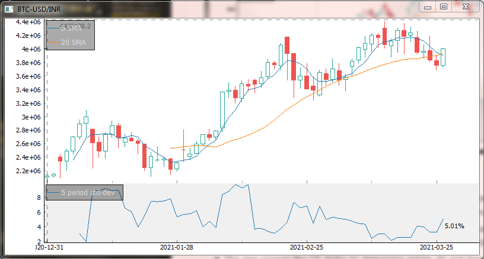

# Synthesizer
The python app can take one asset(including other currencies) and a currency, the program will return a candlestick
plot of that asset denominated in the selected currency. The app requires an MT5 terminal running in the background.
Version-1 of the app is CLI based and Version-2 is GUI based.

## Synthesizer app interface

 
Select the security from the list-box, select the currency from the options-menu, insert the number of periods in hours.
You can optionally insert values for indicators like Simple Moving Average and standard Deviation.
 
The app uses <a href='https://github.com/highfestiva/finplot.git'>finplot</a> by <a href='https://github.com/highfestiva'>highfestiva</a>
for rendering the graph as shown below.
 
 

 
The above candlestick plot is of SnP500 emini futures denominated in Swedish Krona, with 24 & 8 period SMAs and standard deviation ploted
on a separate axis.

# Synthesizer yfinance (Beta)
Version 1 & 2 of Synthesizer have very limited utility as they depend on MT5 terminal and module. This version doesn't.
Synthesizer yfinance utilizes <a href='https://github.com/ranaroussi/yfinance.git'>yfinance</a> to get historical price data,
therefore, it can cross any asset available on <a href='https://finance.yahoo.com'>yahoo finance.</a>
 

## Synthesizer yfinance app interface

 
The yfinance version requires you to insert the symbol of asset as in <a href='https://finance.yahoo.com'>yahoo finance.</a>
Here, 'GC=F' is the symbol for Gold futures(COMEX), you can look for more symbols on yahoo finance. Select the date range for 
historical data on the start & end calanders, select intervals for candles, and finally select a currency from the currency
dropdown list, that you want the asset to be quoted in. Here, I have selected gold against Bitcoin. Press Synthesize and it
will return a candlestick chart as shown below.

You can optionally add 2 Simple moving average and a standard deviation indicator by inserting the period over which to calculate them,
just make sure not to insert periods more than the candles themselves(duh!).

Here is an example of SENSEX quoted in USD.

 
Bitcoin in INR.

Note:
  - This app is still in beta, do not use it for reading candlestick patterns, the candles can be slightly inaccurate at times, but the overall trend is not.
  - After pressing Synthesize the app might take some time to make network calls depending on the cross and time-span you've selected, be a little patient.
